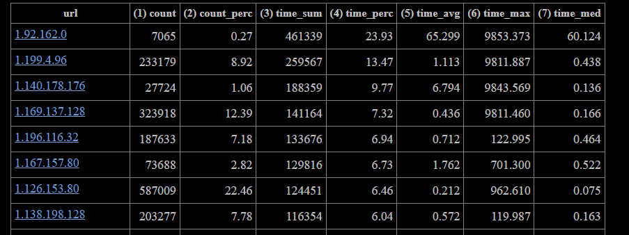

### log-analyzer
анализатор логов

Создан в рамках ДЗ-01 учебной программы OTUS.

Тестирован для версий Python 3.10, 3.11.

*дек'23 - янв'24*
<hr>

### Структура каталога

```
log-analyzer               - ОБЯЗАТЕЛЬНОЕ ЗАДАНИЕ ДЗ
├── log-analyzer           - логи для анализа
├── reports                - готовые отчеты
├── resources
│   ├── config.json        - файл настроек
│   └── report.html        - шаблон отчета
│   └── ...                - прочие вспомогательные файлы
├── log_analyzer.py        ОСНОВНОЙ ФАЙЛ
├── test_log_analyzer.py   - тесты
└── ReadMe.md              - сопроводительная документация

```
### Краткое описание функционала
С помощью данного скрипта можно
- распарсить логи вида:
```
# log_format ui_short 
$remote_addr  $remote_user $http_x_real_ip [$time_local] "$request"
$status $body_bytes_sent "$http_referer" 
"$http_user_agent" "$http_x_forwarded_for" "$http_X_REQUEST_ID" "$http_X_RB_USER"
$request_time
```
- и поместить результаты первичного анализа в отчет вида:



для последующего изучения.


**Более подробно функционал описан в файле [homework.pdf](resources/homework.pdf)**
<hr>

### Работа с командной строкой

Общий вид
``` bash
python log_analyzer.py -h
```
Вывод:
```
usage: log_analyzer.py [-c] [-v] [-h]

log_analyzer - анализатор логов. Создан в рамках ДЗ-01 учебной программы OTUS.

Параметры:
  -c , --config   Файл конфигурации. По-умолчанию это ./resources/config.json
  -v, --version   Номер версии
  -h, --help      Справка

(c) T for Otus 2024. Применение ограничено рамками учебной задачи.
```

Пример запуска:
``` bash
python log_analyzer.py -с ./config.json
```
